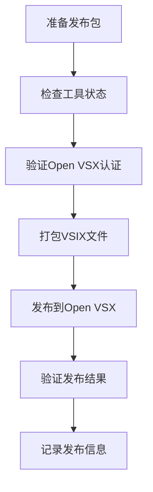

# 三层记忆系统 MCP Server 自动发布操作指南

## 📋 操作流程总览

### 完整发布流程


## 🚀 详细操作步骤

### 1. 准备发布包

#### 1.1 发布包结构
```
memory-mcp-server-v1.6.0/
├── 📄 核心文档 (6个)
├── 🐍 核心代码 (6个)
├── 🔧 发布脚本 (4个)
└── 📁 配置文件 (1个)
```

#### 1.2 必需文件清单
- `README.md` - 项目说明文档
- `LICENSE` - MIT开源许可证
- `CHANGELOG.md` - 版本更新历史
- `RELEASE_NOTES.md` - 发布说明文档
- `package.json` - VSIX扩展配置
- `memory_mcp_simple.py` - MCP主服务器
- `.ldr_memory/` - 记忆系统核心组件
- 发布脚本: `package.bat`, `openvsx-publish.bat`, `openvsx-publish.sh`, `PUBLISH_GUIDE.md`

### 2. 检查工具状态

#### 2.1 前置工具安装
```bash
# 安装VSCE工具
npm install -g @vscode/vsce

# 安装OVSX工具
npm install -g ovsx

# 验证安装
vsce --version    # 应该显示 3.7.1+
ovsx --version    # 应该显示 0.10.9+
```

#### 2.2 工具检查命令
```bash
# 检查VSCE
npm list -g @vscode/vsce

# 检查OVSX
ovsx --version
```

**预期输出**:
```
@vscode/vsce@3.7.1
ovsx@0.10.9
```

### 3. 验证Open VSX认证

#### 3.1 认证检查命令
```bash
# 验证PAT令牌有效性
ovsx verify-pat anderson-memory-tech
```

**预期输出**:
```
🚀 PAT valid to publish at anderson-memory-tech
```

#### 3.2 认证失败处理
如果认证失败，需要：
1. 获取Open VSX Personal Access Token
2. 设置环境变量或使用登录命令

```bash
# 方法1: 设置环境变量
set OVSX_PAT=your_personal_access_token

# 方法2: 登录
ovsx login anderson-memory-tech
```

### 4. 打包VSIX文件

#### 4.1 打包命令
```bash
# 进入发布目录
cd memory-mcp-server-v1.6.0

# 执行打包
vsce package
```

#### 4.2 常见错误及解决方案

**错误1: 依赖检查失败**
```
ERROR missing: mcp@^1.26.0, required by memory-mcp-server-anderson@1.6.0
```

**解决方案**: 移除package.json中的Python依赖
```json
// 修改前
"dependencies": {
  "mcp": "^1.26.0",
  "pydantic": "^2.0.0", 
  "anyio": "^4.0.0"
}

// 修改后
"dependencies": {}
```

**错误2: 图标文件缺失**
```
ERROR The specified icon 'extension/icon.png' wasn't found in the extension.
```

**解决方案**: 移除package.json中的图标配置
```json
// 修改前
"icon": "icon.png",

// 修改后
// 移除icon配置
```

#### 4.3 成功打包标志
```
DONE Packaged: memory-mcp-server-anderson-1.6.0.vsix (19 files, 29.1 KB)
```

**关键检查点**:
- ✅ VSIX文件生成成功
- ✅ 文件大小正常 (>1KB)
- ✅ 包含所有必需文件

### 5. 发布到Open VSX

#### 5.1 发布命令
```bash
# 发布到Open VSX
ovsx publish memory-mcp-server-anderson-1.6.0.vsix
```

#### 5.2 成功发布标志
```
🚀 Published anderson-memory-tech.memory-mcp-server-anderson v1.6.0
```

#### 5.3 发布失败处理
如果发布失败，检查：
1. 版本号是否唯一（不能重复发布相同版本）
2. PAT令牌是否有效
3. 网络连接是否正常

### 6. 验证发布结果

#### 6.1 验证命令
```bash
# 验证插件是否可下载
ovsx get anderson-memory-tech.memory-mcp-server-anderson
```

#### 6.2 成功验证标志
```
Downloading anderson-memory-tech.memory-mcp-server-anderson-1.6.0 to ...
```

#### 6.3 在线验证
访问Open VSX页面验证:
https://open-vsx.org/extension/anderson-memory-tech/memory-mcp-server-anderson

**检查内容**:
- ✅ 插件信息显示正确
- ✅ 版本号正确
- ✅ 下载链接有效

### 7. 记录发布信息

#### 7.1 发布信息汇总
```
插件名称: memory-mcp-server-anderson
版本号: 1.6.0
发布者: anderson-memory-tech
Open VSX URL: https://open-vsx.org/extension/anderson-memory-tech/memory-mcp-server-anderson
VSIX文件大小: 29.1 KB
包含文件数: 19个
```

#### 7.2 更新文档
- 更新CHANGELOG.md
- 更新RELEASE_NOTES.md
- 记录发布时间和版本信息

## 🔧 一键发布脚本

### Windows版本 (package.bat + openvsx-publish.bat)
```bash
# 一键执行
package.bat && openvsx-publish.bat
```

### Linux/macOS版本
```bash
# 设置执行权限
chmod +x package.bat openvsx-publish.sh

# 一键执行
./package.bat && ./openvsx-publish.sh
```

## 🐛 常见问题解决

### 问题1: "ovsx command not found"
**原因**: OVSX工具未安装
**解决**: 
```bash
npm install -g ovsx
```

### 问题2: "vsce command not found"
**原因**: VSCE工具未安装
**解决**:
```bash
npm install -g @vscode/vsce
```

### 问题3: "PAT not valid"
**原因**: Open VSX认证失效
**解决**:
1. 重新获取PAT令牌
2. 设置环境变量或重新登录

### 问题4: "Version already exists"
**原因**: 版本号重复
**解决**:
1. 更新package.json中的版本号
2. 重新打包发布

## 📊 发布检查清单

### 发布前检查
- [ ] package.json配置正确
- [ ] 所有必需文件存在
- [ ] 版本号唯一
- [ ] Open VSX认证有效
- [ ] 发布工具正常

### 发布中检查
- [ ] VSIX打包成功
- [ ] 文件大小正常
- [ ] 发布命令执行成功
- [ ] 无错误信息

### 发布后检查
- [ ] Open VSX页面可访问
- [ ] 插件信息显示正确
- [ ] 下载功能正常
- [ ] 版本号正确

## 🎯 关键成功因素

### 技术要点
1. **正确的package.json配置** - 避免依赖检查错误
2. **有效的Open VSX认证** - 确保发布权限
3. **唯一的版本号** - 避免重复发布
4. **完整的文件结构** - 确保插件功能完整

### 操作要点
1. **按顺序执行** - 先检查工具，再打包，最后发布
2. **及时验证** - 每个步骤后都要验证结果
3. **记录日志** - 保存发布过程中的关键信息
4. **错误处理** - 准备好常见问题的解决方案

## 📝 发布记录模板

### 发布记录格式
```markdown
## [版本号] - 发布日期

### 发布信息
- **插件名称**: 
- **版本号**: 
- **发布者**: 
- **Open VSX URL**: 
- **VSIX文件大小**: 
- **包含文件数**: 

### 发布过程
- [ ] 工具检查: ✅
- [ ] 认证验证: ✅  
- [ ] VSIX打包: ✅
- [ ] 发布执行: ✅
- [ ] 结果验证: ✅

### 遇到的问题及解决方案
- 问题描述: 
- 解决方案: 
- 结果: ✅

### 发布时间线
- 开始时间: 
- 结束时间: 
- 总耗时: 
```

## 🔄 重复操作流程

对于未来的发布，只需按以下步骤操作：

1. **更新版本号** - 修改package.json中的版本
2. **更新文档** - 更新CHANGELOG和RELEASE_NOTES
3. **执行发布脚本** - 运行一键发布命令
4. **验证结果** - 检查Open VSX页面
5. **记录发布** - 更新发布记录

---

**本指南基于 v1.6.0 成功发布经验编写，适用于未来版本的自动发布操作。**